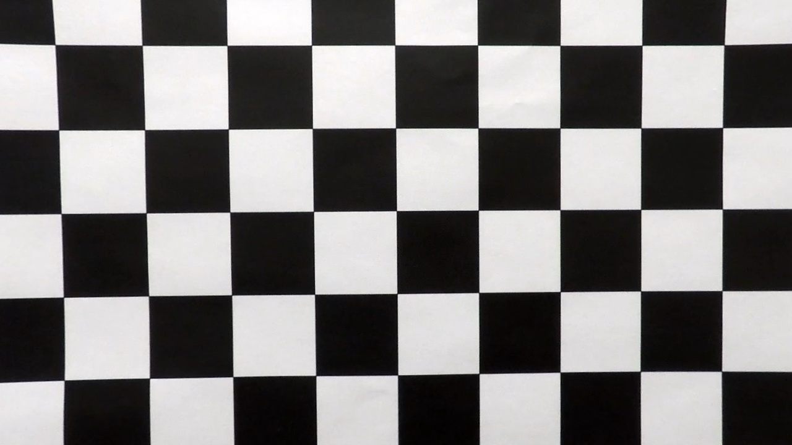

# Writeup

- [code](main.py)

- [output_images](test_images_output)

- [outputs_videos](test_videos_output)

## Image PipeLine
The code is in `main#process_image`. See output [image outputs](./output_images)

- Apply calibration transform. [code](./camera.py#L46-L103)
- Compute a binary image by selecting points by sobel filter in the x direction and color filter in the s channel. [code](./color.py#L120-L152)
- Warp the binary image on a birdeye view perspective. [code](./camera.py#L115-L162)
- Find the left and right lane points by a sliding window search. [code](./lane.py#L61-L141)
- Fit a second degree polynomial on those points [code](./lane.py#L144-L180)
- Draw the lane on the bird eye perspective. 
- Unwarp the birdeye  lane back onto the image. 
- The lane points in the birdeye perspective are warped back to the image perspective. [code](./lane.py#L236-L280) 
- Calculate the curvature of polynomial, with adjustment from the pixel unit to meter unit.
- Calculate offset position by comparing the lane center with image center, and adjust the offset into meter unit
- Overlay all information onto the calibrated image 

## Video PipeLine
The code is in `main#process_video_file` and `main#process_frame`. See output [video outputs](./output_videos). The main steps are similar to the image pipeline. The main difference is that I store the found lane points from the previous five frames, and also the lane point search is done centered around the previous found polynomial.

- Keep a buffer of lane points up to the previous 5 frames.

- The lane line is a fit of all the lane points found in this frame and the buffer.

- The search algorim for lane points is a global sliding window search for the first frame. The subsequent search is centered on the previous lane lines.

- I use a `state` variable to keep track of the buffer of lane points and previous lane lines (e.g. polynomial fit).  

## Discussion
- The search algorithm for lane points is one of the most critical to finding a safe lane line. We are only fitting a low degree polynomial. We don't need too many points to get a good line. The fit could be severely impacted by outlier data points. It could be argued that it is much more important to screen out bad data points than it is to get as many points as possible.   

- The lane line is a second polynomial fit. It would not work in a road with tight S turn. The x^2 polynomial cannot bend twice. The easy solution would allow for a higher degree polynomial with a regularization to avoid over-fitting to a crazy curve.

- The search algorithm for lane points could be trapped in a bad state because we only search around the previous lane. I could do a global search as well as a targeted, local search for each frame, but that would incur a great computing cost. I could sanity check our local search via a global search at an interval to avoid getting stuck in a bad local state.

- The curvature calculation is sensitive to small change. I could have chosen a bird-eye view region that extends further into the horizon.

## Camera Calibration
Camera calibration is done through opencv. The key step is finding the corners (image points). I use opencv's `cv2.calibrateCamera` functions to do that. Once the corners are found, we use the object and image points to calibrate the camera intrinsics.

Here is an example of calibrated image transform.  

<table style="width:100%">
  <tr>
    <th>
      

           
            Raw
      

    </th>
    <th>
      

           
            Calibrated
      

    </th>
  </tr>
</table>

