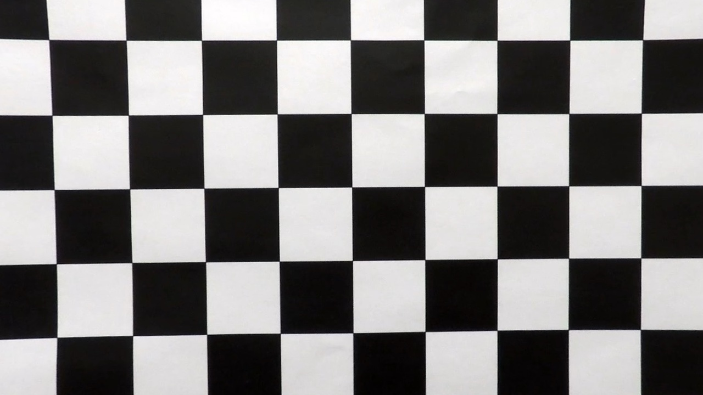

# Writeup


- [code](main.py)

- [image outputs](test_images_output)

- [video outputs](test_videos_output)


## Camera Calibration
Camera calibration is done through opencv. The key step is finding the corners (image points). I use opencv's `cv2.calibrateCamera` functions to do that. Once the corners are found, we use the object and image points to calibrate the camera intrinsics.

Here is an example of calibrated image transform.  

<table style="width:100%">
  <tr>
    <th>
      <p align="center">
           
           <br>Raw
      </p>
    </th>
    <th>
      <p align="center">
           
           <br>Calibrated
      </p>
    </th>
  </tr>
</table>

## 

## Image PipeLine
The code is in `main#process_image`. See output [image outputs](./output_images)

- Apply calibration transform
- Compute a binary image by selecting points by sobel filter in the x direction and color filter in the s channel [image outputs](./output_images#)
- Warp the binary image on a birdeye view perspective
- Find the left and right lane points by a sliding window search
- Transform those points back to the original perspective
- Fit a second degree polynomial on those points
- Calculate the curvature of polynomial, with adjustment from the pixel unit to meter unit.
- Calculate offset position by comparing the lane center with image center, and adjust the offset into meter unit
- Overlay all information onto the calibrated image 


## Video PipeLine
The code is in `main#process_video_file` and `main#process_frame`. See output [video outputs](./output_videos). The main steps are similar to the image pipeline. The main difference is that I store the found lane points from the previous five frames, and also the lane point search is done centered around the previous found polynomial.

- Keep a buffer of lane points up to the previous 5 frames.
- The lane line is a fit of all the lane points found in this frame and the previous buffer.
- Lane points are found centered the previous lane lines.
- I use a `state` variable to keep track of the buffer of lane points and previous lane lines (e.g. polynomial fit).  

 

## Discussion
- The search algorithm for lane points is one of the most critical to finding a safe lane line. We are only fitting a low degree polynomial. We don't need too many points to get a good line. The fit could be severely impacted by outlier data points. It could be argued that it is much more important to screen out bad data points than it is to get as many points as possible.   

- The lane line is a second polynomial fit. It would not work in a road with tight S turn. The x^2 polynomial cannot bend twice. The easy solution would allow for a higher degree polynomial with a regularization to avoid over-fitting to a crazy curve.

- The search algorithm for lane points could be trapped in a bad state because we only search around the previous lane. I could do a global search as well as a targeted, local search for each frame, but that would incur a great computing cost. I could sanity check our local search via a global search at an interval to avoid getting stuck in a bad local state.


- The curvature calculation is sensitive to small change. I could have chosen a bird-eye view region that extends further into the horizon.


## [Rubric](https://review.udacity.com/#!/rubrics/571/view) Points

### Here I will consider the rubric points individually and describe how I addressed each point in my implementation.  

---

### Writeup / README

#### 1. Provide a Writeup / README that includes all the rubric points and how you addressed each one.  You can submit your writeup as markdown or pdf.  [Here](https://github.com/udacity/CarND-Advanced-Lane-Lines/blob/master/writeup_template.md) is a template writeup for this project you can use as a guide and a starting point.  

You're reading it!

### Camera Calibration

#### 1. Briefly state how you computed the camera matrix and distortion coefficients. Provide an example of a distortion corrected calibration image.

The code for this step is contained in the first code cell of the IPython notebook located in "./examples/example.ipynb" (or in lines # through # of the file called `some_file.py`).  

I start by preparing "object points", which will be the (x, y, z) coordinates of the chessboard corners in the world. Here I am assuming the chessboard is fixed on the (x, y) plane at z=0, such that the object points are the same for each calibration image.  Thus, `objp` is just a replicated array of coordinates, and `objpoints` will be appended with a copy of it every time I successfully detect all chessboard corners in a test image.  `imgpoints` will be appended with the (x, y) pixel position of each of the corners in the image plane with each successful chessboard detection.  

I then used the output `objpoints` and `imgpoints` to compute the camera calibration and distortion coefficients using the `cv2.calibrateCamera()` function.  I applied this distortion correction to the test image using the `cv2.undistort()` function and obtained this result: 

![alt text][image1]

### Pipeline (single images)

#### 1. Provide an example of a distortion-corrected image.

To demonstrate this step, I will describe how I apply the distortion correction to one of the test images like this one:
![alt text][image2]

#### 2. Describe how (and identify where in your code) you used color transforms, gradients or other methods to create a thresholded binary image.  Provide an example of a binary image result.

I used a combination of color and gradient thresholds to generate a binary image (thresholding steps at lines # through # in `another_file.py`).  Here's an example of my output for this step.  (note: this is not actually from one of the test images)

![alt text][image3]

#### 3. Describe how (and identify where in your code) you performed a perspective transform and provide an example of a transformed image.

The code for my perspective transform includes a function called `warper()`, which appears in lines 1 through 8 in the file `example.py` (output_images/examples/example.py) (or, for example, in the 3rd code cell of the IPython notebook).  The `warper()` function takes as inputs an image (`img`), as well as source (`src`) and destination (`dst`) points.  I chose the hardcode the source and destination points in the following manner:

```python
src = np.float32(
    [[(img_size[0] / 2) - 55, img_size[1] / 2 + 100],
    [((img_size[0] / 6) - 10), img_size[1]],
    [(img_size[0] * 5 / 6) + 60, img_size[1]],
    [(img_size[0] / 2 + 55), img_size[1] / 2 + 100]])
dst = np.float32(
    [[(img_size[0] / 4), 0],
    [(img_size[0] / 4), img_size[1]],
    [(img_size[0] * 3 / 4), img_size[1]],
    [(img_size[0] * 3 / 4), 0]])
```

This resulted in the following source and destination points:

| Source        | Destination   | 
|:-------------:|:-------------:| 
| 585, 460      | 320, 0        | 
| 203, 720      | 320, 720      |
| 1127, 720     | 960, 720      |
| 695, 460      | 960, 0        |

I verified that my perspective transform was working as expected by drawing the `src` and `dst` points onto a test image and its warped counterpart to verify that the lines appear parallel in the warped image.

![alt text][image4]

#### 4. Describe how (and identify where in your code) you identified lane-line pixels and fit their positions with a polynomial?

Then I did some other stuff and fit my lane lines with a 2nd order polynomial kinda like this:

![alt text][image5]

#### 5. Describe how (and identify where in your code) you calculated the radius of curvature of the lane and the position of the vehicle with respect to center.

I did this in lines # through # in my code in `my_other_file.py`

#### 6. Provide an example image of your result plotted back down onto the road such that the lane area is identified clearly.

I implemented this step in lines # through # in my code in `yet_another_file.py` in the function `map_lane()`.  Here is an example of my result on a test image:

![alt text][image6]

---

### Pipeline (video)

#### 1. Provide a link to your final video output.  Your pipeline should perform reasonably well on the entire project video (wobbly lines are ok but no catastrophic failures that would cause the car to drive off the road!).

Here's a [link to my video result](./project_video.mp4)

---

### Discussion

#### 1. Briefly discuss any problems / issues you faced in your implementation of this project.  Where will your pipeline likely fail?  What could you do to make it more robust?

Here I'll talk about the approach I took, what techniques I used, what worked and why, where the pipeline might fail and how I might improve it if I were going to pursue this project further.  
