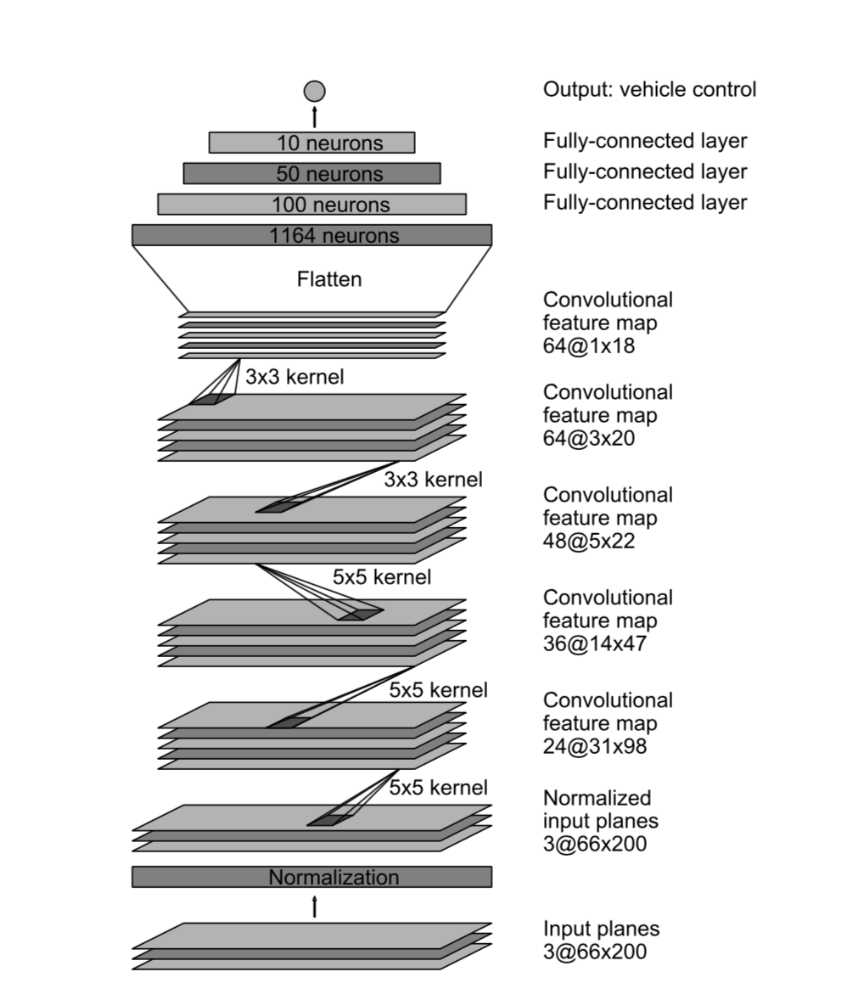

# **Behavioral Cloning** 


### Code 

- [model.py](./model.py) contains all the code that is needed to train and save the trained model
- [model.h5](./model.h5) is the trained model
- [video.mp4](./video.mp4) is the video produced by the simulator from driving with the trained model. 

### Data 

- I played around of the simulator to collect training data. Utimately, I decided to use 
  the provided training data set. Some of the data set that I collected was lost due to
  workspace restarting. 

- Data normalization is done through a Lambda and a cropping layer.

- I normalize the input data between 0 and 1. 

- I crop the frame vertically to ignore the top half of the horizon. The sky does not
contain much useful information to how the car should be steered. All those pixels would
contribute to more noises.

- I use a data generator. Each batch of data is randomly shuffled. 


### Model Architecture

The network architecture is borrowed from the NVIDIA paper. The nvidia model is engineered to
handle the problem of steering from camera inputs. The architecture looks similar to the following 

 

The final model looks like the following:

```bash
_________________________________________________________________
Layer (type)                 Output Shape              Param #
=================================================================
input_1 (InputLayer)         (None, 160, 320, 3)       0
_________________________________________________________________
lambda_1 (Lambda)            (None, 160, 320, 3)       0
_________________________________________________________________
cropping2d_1 (Cropping2D)    (None, 70, 320, 3)        0
_________________________________________________________________
conv2d_1 (Conv2D)            (None, 33, 158, 24)       1824
_________________________________________________________________
elu_1 (ELU)                  (None, 33, 158, 24)       0
_________________________________________________________________
dropout_1 (Dropout)          (None, 33, 158, 24)       0
_________________________________________________________________
conv2d_2 (Conv2D)            (None, 15, 77, 36)        21636
_________________________________________________________________
elu_2 (ELU)                  (None, 15, 77, 36)        0
_________________________________________________________________
dropout_2 (Dropout)          (None, 15, 77, 36)        0
_________________________________________________________________
conv2d_3 (Conv2D)            (None, 6, 37, 48)         43248
_________________________________________________________________
elu_3 (ELU)                  (None, 6, 37, 48)         0
_________________________________________________________________
dropout_3 (Dropout)          (None, 6, 37, 48)         0
_________________________________________________________________
conv2d_4 (Conv2D)            (None, 4, 35, 64)         27712
_________________________________________________________________
elu_4 (ELU)                  (None, 4, 35, 64)         0
_________________________________________________________________
dropout_4 (Dropout)          (None, 4, 35, 64)         0
_________________________________________________________________
conv2d_5 (Conv2D)            (None, 2, 33, 64)         36928
_________________________________________________________________
elu_5 (ELU)                  (None, 2, 33, 64)         0
_________________________________________________________________
dropout_5 (Dropout)          (None, 2, 33, 64)         0
_________________________________________________________________
flatten_1 (Flatten)          (None, 4224)              0
_________________________________________________________________
dense_1 (Dense)              (None, 100)               422500
_________________________________________________________________
elu_6 (ELU)                  (None, 100)               0
_________________________________________________________________
dropout_6 (Dropout)          (None, 100)               0
_________________________________________________________________
dense_2 (Dense)              (None, 50)                5050
_________________________________________________________________
elu_7 (ELU)                  (None, 50)                0
_________________________________________________________________
dropout_7 (Dropout)          (None, 50)                0
_________________________________________________________________
dense_3 (Dense)              (None, 10)                510
_________________________________________________________________
elu_8 (ELU)                  (None, 10)                0
_________________________________________________________________
dense_4 (Dense)              (None, 1)                 11
=================================================================

```
- There are closed to half of a million parameters. It is not huge and it is still trainable on my
  laptop on cpu, albeit it will take more than 1 day.
 
- Note that there are 3 fully connected layers, and it finally output a
  single regression neuron that predicts the steering angle.

- I add dropout extensively. I use a dropout in between both the convolution and 
  fully connected layers. This ensure that the network can get some redundant 
  features and regularize the model to mitigate overfitting.
  
- I augment the data by mirroring, perturb the brightness, and purturb the steering angles.
  This adds more variety to the data and shoud mitigate overfitting.   

### Training Strategy

- I choose the exponential ReLU activation because it is shown to converge faster 
than the constant ReLU. [Ref](https://ml-cheatsheet.readthedocs.io/en/latest/activation_functions.html#elu.)

- I use a 80/20 training and validation split.

- I am using the Adam optimizer. I chose this because it is straight forward and 
  has less parameters to tweak. For example, I don't have to tune learning rate manually.
  
- I use a mean square error. This choice does not seem to affect the training time and performance
  too much with other choices that I have tried.
 
- The model was trained on the GRU-enabled workspace provided by Udacity.


### Final Discussion
- The model was able to drive the car quite successfully around the track.

- It is slightly surprising to me that even with so limited data, the model was 
  successful. One reason would be that the training and test data are very similar because
  it is in a simulated environment. It would be interesting to see if the same model would work
  for a real car with three mounted camera on a standard track. 
  
- When I was training with data when I was driving badly, the trained model was able to get 
  similar behaviors. For example, I was consistently driving off the road slightly on turns, 
  and trying to recover from driving off the lane. The trained model seems to emulate that behaviors.
  The final model was trained on data that does not have that behaviors because the driving
  is performed safely.  

- I tried images with higher quality. They are much harder to trained, and the results do not seem
  to be definitely better. It could be reasoned that the additional pixels don't really add to 
  better decision making, as even low resolution images contain sufficient data to make steering
  decisions. The additional data is just adding to the noise.

- The data augmentation could be more extensive to make the model more robust.

- We can easily generate more training data to improve the model.

- If we can record while in autonomous mode, then we could augment the autonomous driving 
  with human intervention. This could generate data set that incrementally correct tricky spots of
  the existing models.
